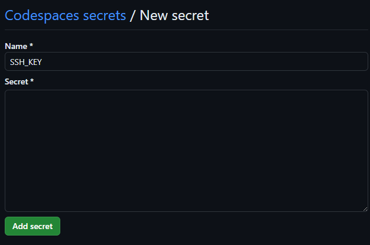

# Install AWS Learner Lab .pem key
This repository contains the configuration files necessary to install your SSH (.pem) key from the AWS Learner Lab into every Codespace you create account wide using GitHub Secrets. This allows you to access your instance via SSH from the terminal in Codespaces.

1. Use this as a template to create a repo called dotfiles (if you do not already have one). Your dotfiles repo can be private, and it will still work. The file **install.sh** installs the .pem file upon Codespace creation.
1. Add your .pem file as a GitHub secret called "SSH_KEY" using the following steps in **YOUR** new repository:
    - Go to **Settings** (top right corner)
    - Click on **Secrets and variables**
    - Click on **Codespaces**
    - Click the Green button labelled **New repository secret**
1. Add the secret:
    - With the name **SSH_KEY**
    - In the **Secret** field, paste in the contents of your .pem file (cat from your local command line and copy/paste)
    - Your screen should look as follows (note, in the screenshot the secret field has been left empty)
    
    - Click the green button labelled **Add secret**
1. Follow the documentation here to enable your dotfiles repo. https://docs.github.com/en/codespaces/setting-your-user-preferences/personalizing-github-codespaces-for-your-account#dotfiles
1. You may need to rebuild the container for any existing Codespaces you own.
1. Note: Keys added via your dotfiles repo will be installed over top of per-repo keys with this configuration.
